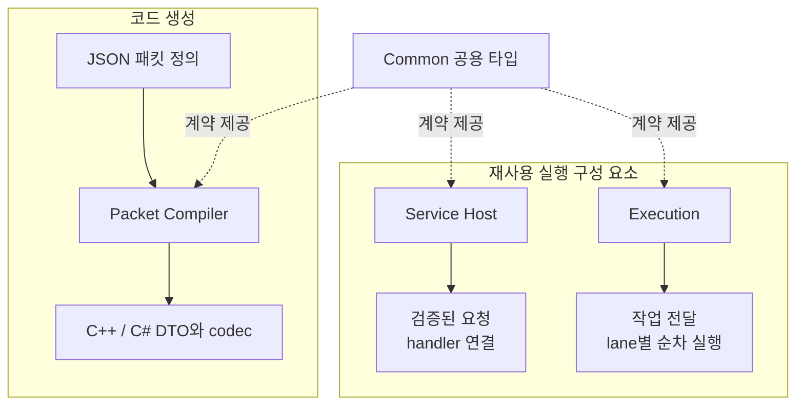

# PrivateServerToolKit 개요

> Document status: Reviewed
> Baseline: PrivateServerToolKit 6ce47a6e89e6796ee5b6da774c5db05c495aa735
> Last reviewed: 2026-09-05

PrivateServerToolKit은 패킷 정의를 코드로 바꾸는 개발 도구와, 패킷을 서비스 호출 및 작업 실행에 연결하는 재사용 native 구성 요소를 제공한다. 이 문서는 게임 서버 자체의 흐름과 구분해 **무엇을 생성하고, 무엇을 실행하며, consumer가 무엇을 결정하는지** 보여준다.

아래 Mermaid가 편집 원본이며, 같은 그림의 [SVG](diagrams/toolkit-overview.svg)를 발표 자료나 글에 사용할 수 있다.

## 제공하는 구성 요소

화살표는 제공하는 산출물 또는 기능을 뜻한다. 아래 묶음은 책임 구분이며 별도 서버 process를 뜻하지 않는다.

| 구성 요소 | 핵심 책임 | 현재 코드의 경계 |
| --- | --- | --- |
| Common | Byte View, `TkResult`, Diagnostic | header-only 계약 |
| Packet | schema 검증, C++/C# source 생성 | CLI와 C ABI shared library |
| Generated codec | 타입 있는 값과 semantic payload 간 변환 | consumer에 함께 컴파일하는 source |
| Service Host | packet binding, Decode, middleware, Service Job과 응답 Encode | C ABI shared library와 C++ typed facade |
| Execution | bounded queue, serial lane, worker pool과 scheduler | static library와 C++ template |

Service Host와 Execution은 각각 사용할 수 있다. Service Host는 consumer가 등록한 executor callback에 작업을 넘기며, 내부에서 Execution scheduler를 자동 생성하거나 특정 NetworkRuntime을 선택하지 않는다.

## 읽는 순서

| 알고 싶은 내용 | 문서 |
| --- | --- |
| 같은 패킷 정의가 C++과 C#에서 어떻게 사용되는가? | [패킷 코드 생성과 소비 흐름](packet-code-generation.md) |
| raw payload가 타입 있는 서비스 호출이 되는 경계는 어디인가? | [Service Host와 실행 ownership](service-host-and-execution.md) |
| Private Server의 현재 게임 실행 구조는 무엇인가? | [전체 시스템 아키텍처](../system-architecture.md) |

## Consumer에게 남기는 결정

ToolKit은 transport framing, 연결의 실제 유효성, 서비스 객체의 수명, 게임 규칙과 실행 시점을 consumer에 남긴다. `TkHostConnectionKey`는 연결을 가리키는 값이며 Host 자체가 socket이나 NetworkRuntime session을 소유하지 않는다. Common의 byte view도 메모리 소유권을 넘기는 객체가 아니다.

현재 Private Server의 게임 실행 구조와 이 ToolKit의 제공 기능은 별도로 읽어야 한다. ToolKit의 모듈이 존재한다는 사실이 현재 World Server에 통합되어 있다는 뜻은 아니다. WorldRuntime은 이 기준 버전의 빌드 구성에 포함된 실행 모듈이 아니다.

## 구현 탐색

아래 링크는 이 문서의 기준인 **PrivateServerToolKit commit**에 고정되어 있다.

| 질문 | 구현과 결정 |
| --- | --- |
| 실제로 어떤 모듈이 빌드되는가? | [루트 CMake](https://github.com/jammer-droid/PrivateServerToolKit/blob/6ce47a6e89e6796ee5b6da774c5db05c495aa735/CMakeLists.txt), [Execution target](https://github.com/jammer-droid/PrivateServerToolKit/blob/6ce47a6e89e6796ee5b6da774c5db05c495aa735/src/execution/CMakeLists.txt) |
| 공용 데이터 계약은 어디에 있는가? | [Common public headers](https://github.com/jammer-droid/PrivateServerToolKit/tree/6ce47a6e89e6796ee5b6da774c5db05c495aa735/src/common/include/pstk) |
| shared-library 경계와 C++ facade는 어떻게 구분하는가? | [C ABI 결정](https://github.com/jammer-droid/PrivateServerToolKit/blob/6ce47a6e89e6796ee5b6da774c5db05c495aa735/docs/adr/0006-fix-shared-library-public-boundary-to-c-abi.md) |
| 생성 도구와 생성 코드의 의존성은 왜 다른가? | [Generated-code consumer 경계](https://github.com/jammer-droid/PrivateServerToolKit/blob/6ce47a6e89e6796ee5b6da774c5db05c495aa735/docs/adr/0005-generated-code-consumer-boundary.md) |
