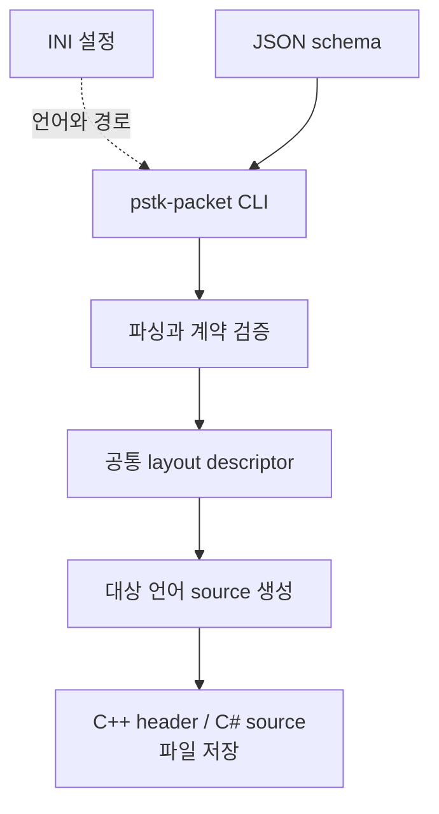
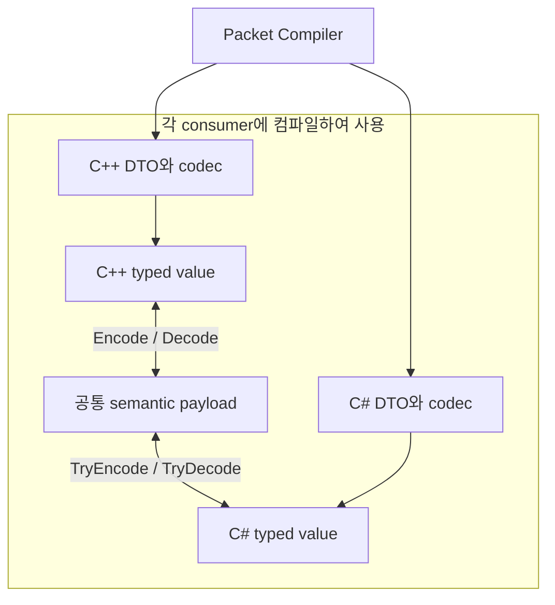

# 패킷 코드 생성과 소비 흐름

> Document status: Reviewed
> Baseline: PrivateServerToolKit 6ce47a6e89e6796ee5b6da774c5db05c495aa735
> Last reviewed: 2026-09-05

패킷의 ID, version과 field 배치를 JSON으로 정의하면 Packet Compiler가 C++ 또는 C# DTO와 codec을 생성한다. 생성 도구는 개발 시 실행하고, 실제 패킷 교환에서는 각 consumer에 컴파일된 codec을 사용한다.

## JSON에서 source까지

이 흐름의 [SVG](diagrams/packet-code-generation.svg)도 제공한다. 편집 원본은 아래 Mermaid다.

실선은 생성 순서, 점선은 설정 입력을 뜻한다. Compiler 내부 단계는 별도 실행 process가 아니다.



CLI는 설정 파일을 기준으로 상대 경로를 해석한다. 입력이 디렉터리라면 하위의 JSON schema를 수집하고 정렬한 뒤 compiler에 전달한다. API consumer는 `TkPacketCompileInfo`에 파일 목록, 출력 디렉터리, namespace와 Diagnostic callback을 담아 `TkPacketCompileCpp` 또는 `TkPacketCompileCSharp`를 직접 호출할 수 있다.

Compiler는 JSON과 schema를 검증하고 같은 입력 묶음의 packet ID·이름 중복을 거부한다. 공통 descriptor가 field의 wire 배치를 정하므로 언어별 generator는 같은 패킷 계약을 각 언어의 source로 표현한다.

## 생성 도구와 게임 실행의 경계

첫 화살표는 source 생성, 이후 화살표는 codec으로 변환하는 데이터 흐름이다. C++과 C#의 실행 위치는 consumer가 정하며 아래 그림 자체가 Private Server의 현재 통합 배치를 뜻하지 않는다.



| 소비 경계 | 필요한 의존성 | 성공·실패 계약 |
| --- | --- | --- |
| Compiler API 호출 | Packet shared library와 C ABI header | `TkResult`와 Diagnostic callback |
| Generated C++ 사용 | Common header와 C++ codec support | `Encode` / `Decode`, `TkResult` |
| Generated C# 사용 | 생성 source와 C# codec support | `TryEncode` / `TryDecode`, `bool` |

Generated C++의 codec 사용 자체는 Packet compiler shared library 링크를 요구하지 않는다. Generated C#에도 native ToolKit library나 native 공용 타입을 강제하지 않는다. 공유하는 것은 wire 계약이며 언어별 API 모양은 다르다.

## Payload가 담당하는 구간

```text
transport가 전달하는 정보
├─ transport header와 packet ID   : consumer / NetworkRuntime 경계
└─ semantic payload              : generated codec 경계
   ├─ payload version
   └─ schema에 선언된 field 순서
```

`PayloadBytes`는 version과 field를 포함하는 정확한 semantic payload 크기다. Transport header는 포함하지 않는다. 큰 buffer를 사용하더라도 codec에는 해당 payload 구간만 view 또는 span으로 잘라 전달해야 한다. 크기가 다르거나 Decode할 version이 맞지 않으면 codec은 실패한다.

C++ Encode 실패는 출력 buffer를, Decode 실패는 대상 객체를 보존한다. C# Encode 실패도 buffer를 보존하며 Decode 실패는 `false`와 `default`를 반환한다. Byte view와 span은 원본 메모리를 소유하지 않으므로 호출하는 동안 buffer 수명은 consumer가 유지한다.

## 생성 실패와 파일 보존

Schema 검증과 모든 source 생성은 파일 저장 전에 끝난다. 검증 또는 생성 단계에서 실패하면 생성 파일을 쓰기 시작하지 않는다. 저장 시 기존 내용과 같으면 다시 쓰지 않고, 달라진 파일은 임시 파일 작성 후 교체한다.

파일 보존의 단위는 개별 파일이다. 출력 묶음 전체의 transaction을 제공하지 않으므로 저장 도중 I/O 실패가 나면 앞서 저장한 파일과 기존 파일이 함께 남을 수 있다. 동기 compiler 호출에 넘긴 문자열과 Diagnostic은 borrowed 데이터이며, callback 밖에서 진단을 보관하려면 consumer가 복사한다.

## 구현과 계약 테스트

아래 링크는 PrivateServerToolKit 기준 commit에 고정되어 있다. 테스트는 확인할 동작의 위치를 안내한다.

| 확인할 흐름 | Source와 테스트 |
| --- | --- |
| 설정과 입력 파일 수집 | [CLI](https://github.com/jammer-droid/PrivateServerToolKit/blob/6ce47a6e89e6796ee5b6da774c5db05c495aa735/src/tools/packet/cli/TkPacketCli.cpp) |
| schema → descriptor → 언어별 생성 | [Schema compiler](https://github.com/jammer-droid/PrivateServerToolKit/blob/6ce47a6e89e6796ee5b6da774c5db05c495aa735/src/tools/packet/src/schema/TkPacketSchemaCompiler.cpp), [Compiler pipeline](https://github.com/jammer-droid/PrivateServerToolKit/blob/6ce47a6e89e6796ee5b6da774c5db05c495aa735/src/tools/packet/src/generator/TkPacketCompiler.cpp) |
| 동일 파일 생략과 실패 시 기존 파일 보존 | [File committer](https://github.com/jammer-droid/PrivateServerToolKit/blob/6ce47a6e89e6796ee5b6da774c5db05c495aa735/src/tools/packet/src/generator/TkPacketGeneratedFileCommitter.cpp), [Compiler tests](https://github.com/jammer-droid/PrivateServerToolKit/blob/6ce47a6e89e6796ee5b6da774c5db05c495aa735/src/tools/packet/tests/TkPacketCompilerTests.cpp) |
| wire 표현과 codec 실패 계약 | [C++ generated codec tests](https://github.com/jammer-droid/PrivateServerToolKit/blob/6ce47a6e89e6796ee5b6da774c5db05c495aa735/src/tools/packet/tests/TkPacketGeneratedCodecTests.cpp), [C# packet tests](https://github.com/jammer-droid/PrivateServerToolKit/blob/6ce47a6e89e6796ee5b6da774c5db05c495aa735/src/dotnet/tests/packet/PstkPacketTests.cs) |

[ToolKit 개요](README.md) · [Service Host와 실행 ownership](service-host-and-execution.md)
