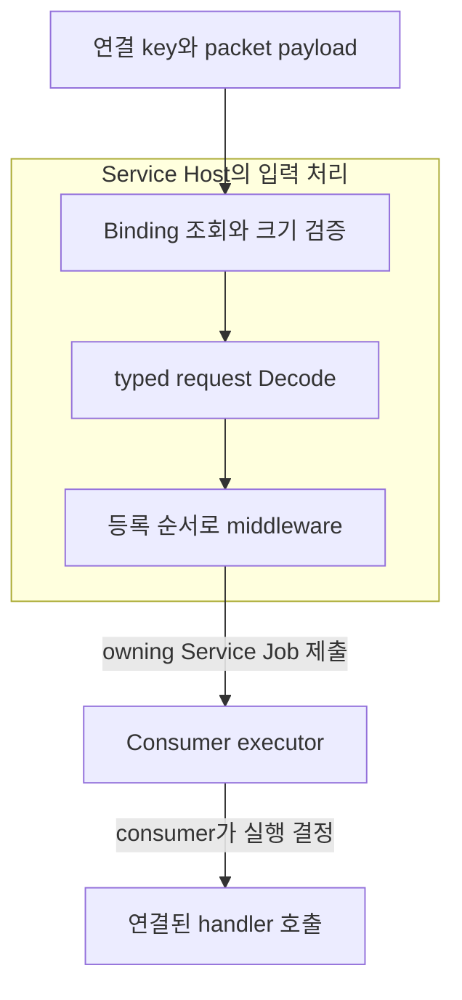
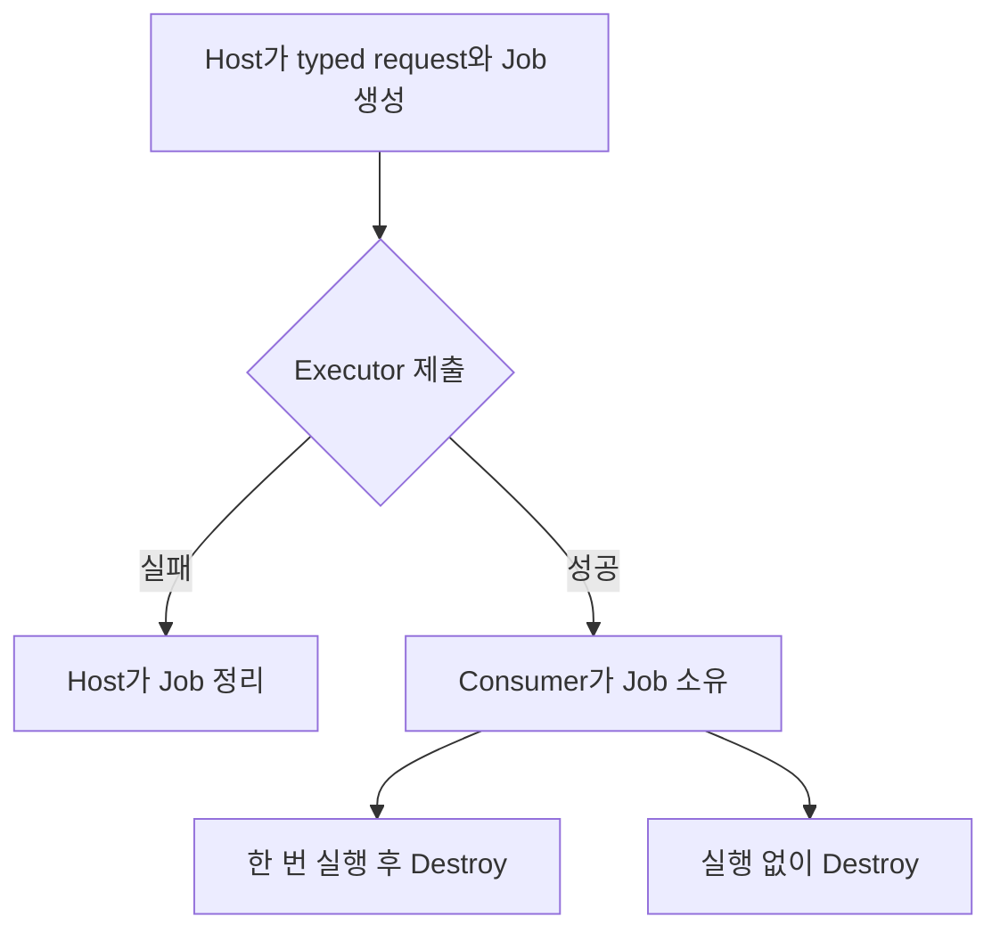
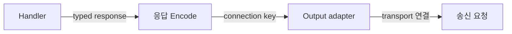
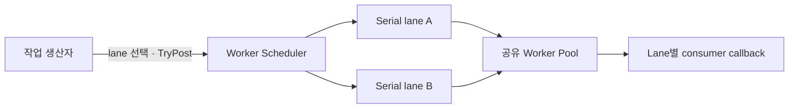

# Service Host와 실행 ownership

> Document status: Reviewed
> Baseline: PrivateServerToolKit 6ce47a6e89e6796ee5b6da774c5db05c495aa735
> Last reviewed: 2026-09-05

Service Host는 raw payload를 검증하고 타입 있는 요청으로 Decode한 뒤, consumer가 지정한 executor에 Service Job을 넘긴다. **입력을 받아들였다는 사실과 handler가 실행됐다는 사실을 분리**하여 서비스 객체와 게임 상태의 실행 규칙을 consumer가 유지하게 한다.

## 입력부터 handler까지

이 흐름의 [SVG](diagrams/service-host-request-flow.svg)도 제공한다. 편집 원본은 아래 Mermaid다.

화살표는 요청 처리 순서다. Host Core의 입력 검증과 executor 이후의 서비스 실행을 나눠 표시한다. Executor는 consumer가 제공하는 callback 경계이며 별도 thread를 반드시 뜻하지 않는다.

Service Binding은 packet 타입 하나를 서비스의 특정 handler에 연결한다. 등록할 때 서비스 객체, executor, middleware와 binding 정보를 전달하고, `TkServiceHostFinalizeRegistration`으로 lookup을 고정한 뒤 패킷을 처리한다. 등록 정보는 Host가 복사하지만 서비스 객체와 callback context의 소유권은 이전되지 않는다.

Host는 packet ID와 payload 크기를 확인한 후 Decode하고 middleware를 등록 순서로 호출한다. Middleware는 connection key와 packet ID 같은 metadata를 받으며, 요청 본문의 도메인 검증은 handler가 수행한다. 등록되지 않은 packet, 잘못된 크기, Decode 실패 또는 middleware 거부는 executor 제출 전에 흐름을 멈춘다.

## Service Job이 넘겨받는 수명

화살표는 소유권과 정리 책임의 변화다. 제출 성공과 실패는 executor callback의 반환값으로 결정된다.

성공적으로 수락한 executor는 `TkServiceJobExecute`와 `TkServiceJobDestroy`를 책임진다. 실행은 일회성이며 handler가 실패해도 같은 Job을 다시 실행하지 않는다. Executor가 제출 callback 안에서 즉시 실행하고 파괴하는 사용도 가능하다.

Job은 Decode된 요청과 호출에 필요한 정보를 보관하므로 원래 raw payload를 비동기 실행까지 유지할 필요가 없다. 수락된 Job은 Host를 파괴한 뒤에도 사용할 수 있지만, 참조하는 서비스 객체, callback context와 callback code는 Job이 끝날 때까지 살아 있어야 한다. Host 파괴 자체가 consumer의 Job을 drain하지는 않는다.

## 응답이 있는 binding

One-way binding은 handler 실행으로 끝난다. Request-response binding은 handler 성공 후 응답을 Encode하여 output adapter에 전달한다. 앞 단계가 실패하면 다음 단계를 호출하지 않는다. Output adapter의 성공은 해당 출력 요청을 수락했다는 의미이며 상대의 수신 완료를 뜻하지 않는다.

응답 payload는 Job이 가진 메모리의 borrowed view다. Adapter가 callback 이후에도 송신에 사용하려면 그 안에서 데이터를 복사하거나 자신의 owning 송신 객체로 옮겨야 한다. 연결의 실제 유효성과 transport framing은 adapter가 연결하는 consumer 측 책임이다.

## Execution: lane의 순서는 유지하고 worker는 공유한다

Execution은 Service Host와 독립된 작업 실행 구성 요소다. 아래는 `TkWorkerScheduler<T>`가 제공하는 흐름이며, Host의 기본 내부 pipeline이 아니다. 화살표는 값의 게시와 callback 실행을 뜻한다.

Scheduler는 lane queue와 worker pool을 소유한다. 같은 lane은 한 drain owner가 순서대로 소비하고, 다른 lane은 가용 worker에 따라 병렬 실행할 수 있다. Lane을 특정 thread에 고정하는 구조는 아니다. 한 번에 소비할 작업량을 `maxMessagesPerDrain`으로 제한하고 남은 작업이 있으면 lane을 다시 scheduling한다.

Queue가 가득 차서 게시를 거부하면 입력 값은 caller에 남는다. 수락하면 queue로 이동한다. 종료 시 `Drain`은 수락한 작업을 실행하고, `Discard`는 진행 중인 실행을 기다리면서 대기 중인 작업을 파괴한다. Worker 자신의 callback에서 자신이 속한 scheduler를 정지하려는 호출은 거부된다.

현재 `PSTK::Execution`은 consumer에 링크되는 static library와 template이다. 독립 process나 Service Host shared library 내부 worker로 해석하지 않는다. 연결 key를 어느 lane에 배정할지, raw packet을 어떤 owning 작업으로 보관할지, Service Job을 어느 실행 영역에 맡길지는 consumer가 조립해야 한다.

## 구현과 계약 테스트

아래 링크는 PrivateServerToolKit 기준 commit에 고정되어 있다. 특정 NetworkRuntime adapter와 World tick의 조립은 이 모듈들의 제공 범위 밖이다.

| 확인할 흐름 | Source와 테스트 |
| --- | --- |
| C ABI와 typed binding | [Host public API](https://github.com/jammer-droid/PrivateServerToolKit/blob/6ce47a6e89e6796ee5b6da774c5db05c495aa735/src/runtime/service_host/include/pstk/service_host/TkServiceHost.h), [C++ facade](https://github.com/jammer-droid/PrivateServerToolKit/blob/6ce47a6e89e6796ee5b6da774c5db05c495aa735/src/runtime/service_host/include/pstk/service_host/TkServiceBinding.hpp) |
| 검증 순서, 제출 실패, Host 이후의 Job 수명 | [Host implementation](https://github.com/jammer-droid/PrivateServerToolKit/blob/6ce47a6e89e6796ee5b6da774c5db05c495aa735/src/runtime/service_host/src/TkServiceHost.cpp), [Pipeline tests](https://github.com/jammer-droid/PrivateServerToolKit/blob/6ce47a6e89e6796ee5b6da774c5db05c495aa735/src/runtime/service_host/tests/TkServiceHostPipelineTests.cpp) |
| 응답 생성부터 output adapter까지 | [Response tests](https://github.com/jammer-droid/PrivateServerToolKit/blob/6ce47a6e89e6796ee5b6da774c5db05c495aa735/src/runtime/service_host/tests/TkServiceHostResponseTests.cpp), [Generated TimeSync integration tests](https://github.com/jammer-droid/PrivateServerToolKit/blob/6ce47a6e89e6796ee5b6da774c5db05c495aa735/src/tools/packet/tests/TkServiceHostTimeSyncTests.cpp) |
| lane 순차 실행, 재스케줄과 종료 | [Scheduler](https://github.com/jammer-droid/PrivateServerToolKit/blob/6ce47a6e89e6796ee5b6da774c5db05c495aa735/src/execution/include/pstk/execution/TkWorkerScheduler.hpp), [Scheduler tests](https://github.com/jammer-droid/PrivateServerToolKit/blob/6ce47a6e89e6796ee5b6da774c5db05c495aa735/src/execution/tests/TkWorkerSchedulerTests.cpp) |

[ToolKit 개요](README.md) · [패킷 코드 생성과 소비 흐름](packet-code-generation.md)
