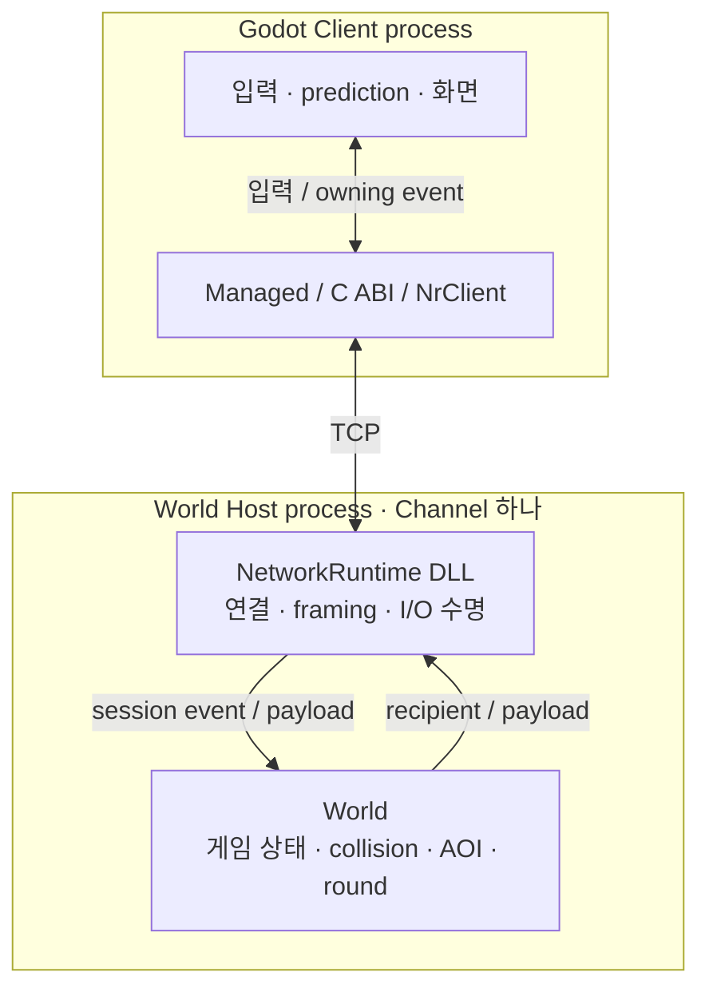
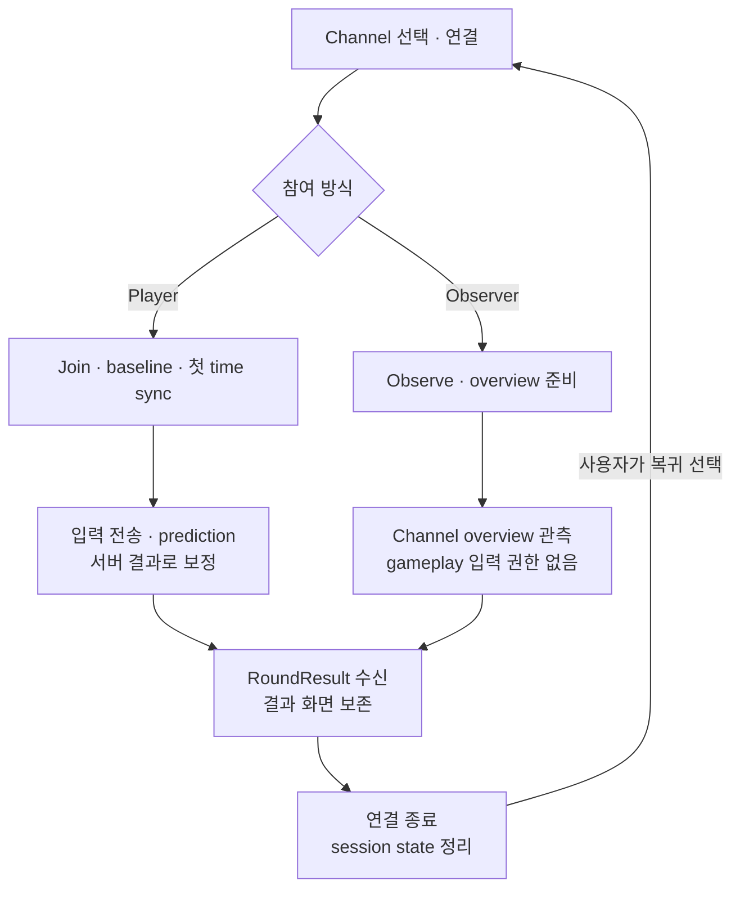
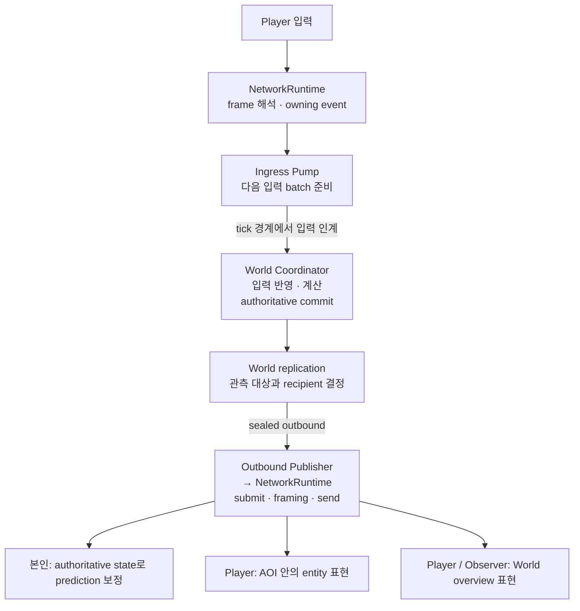
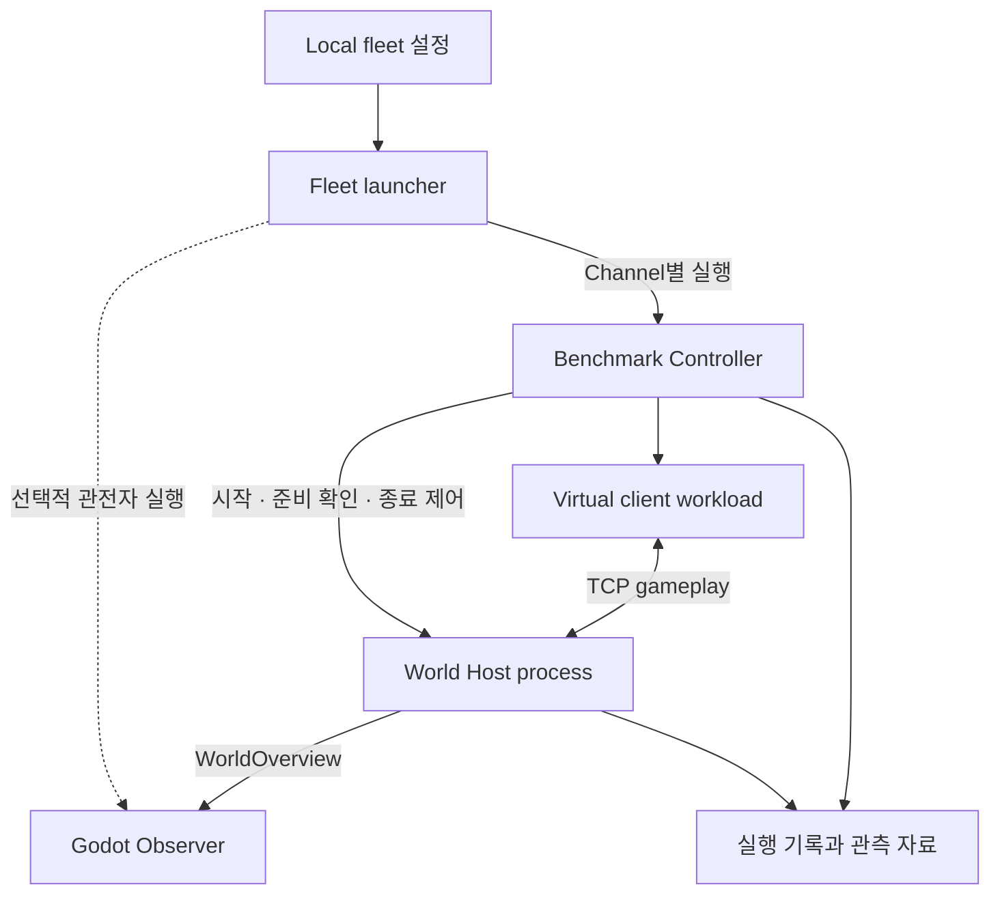

# Private Server 시각 개요

> Document status: Reviewed
> Baseline: 0f1fa513762b40bd03a8f5b4203c61d2bb597cd8
> Last reviewed: 2026-09-05

Private Server는 **입력은 Client가 만들고, 게임 결과는 World가 확정하며, 연결과 전송 수명은 NetworkRuntime이 관리하는** MMO-lite 프로젝트다. 아래 그림은 실행 경계에서 시작해 게임 한 사이클과 상태 전달을 따라간다. Packet field와 개별 클래스는 연결된 상세 문서에서 확인할 수 있다.

그림의 편집 원본은 이 Markdown의 Mermaid block이다. 발표 자료나 이미지 중심 글에는 [실행 구조 SVG](diagrams/project-runtime.svg), [게임 사이클 SVG](diagrams/game-cycle.svg), [입력과 replication SVG](diagrams/input-to-replication.svg)를 사용할 수 있다. SVG는 이 문서의 기준 버전에서 내보낸 그림이다.

## 무엇이 어디서 실행되는가?

바깥 묶음은 실행 프로세스, 내부 상자는 책임, 화살표는 데이터가 오가는 경계다. World는 Host에 링크된 library의 코드이며 별도 프로세스가 아니다. Host가 World state와 worker를 소유한다. 여러 Channel은 각자의 Host process와 World state를 가지며, Client가 local Channel Directory에서 endpoint를 선택한다.

Runtime은 게임 규칙을 해석하지 않고 World는 socket이나 pending I/O를 관리하지 않는다. 이 분리 덕분에 transport 수명과 gameplay 상태 변경을 각각의 owner 안에서 설명할 수 있다. [전체 시스템 아키텍처](system-architecture.md)에서 build dependency와 public API 경계를 이어 볼 수 있다.

## 접속한 사용자는 어떤 흐름을 거치는가?

화살표는 정상적인 사용자 진행 순서다. Player는 controlled entity와 상세 AOI replica를 가지며, Observer는 Player/entity binding 없이 World overview를 읽는다. RoundResult를 표시할 local 결과는 연결 정리 뒤에도 유지된다. 재접속은 새로운 baseline에서 시작한다. [End-to-end 게임 사이클](end-to-end-game-cycle.md)에서 admission 실패와 entity 재생성 흐름을 확인할 수 있다.

## 입력이 어떻게 모두가 보는 게임 결과가 되는가?

화살표는 데이터 처리 순서다. Pump·Coordinator·Publisher는 같은 Host 안의 실행 역할이다. 입출력 준비와 전송 제출을 나눠도 canonical World state를 변경하는 권한은 Coordinator에 남는다. AOI는 **상세히 보여 줄 대상**을 고르는 규칙이고, Active Area는 **살아남을 수 있는 영역**을 정하는 gameplay 규칙이다.

구체적인 인계 경계는 [World 실행 pipeline](world-server/runtime-ownership-and-tick-pipeline.md), 전달할 상태의 선택은 [AOI와 replication](world-server/aoi-active-area-and-replication.md), 화면 반영은 [Client lifecycle](game-client/main-thread-session-and-presentation-lifecycle.md)에서 설명한다.

## 여러 Channel의 동작은 어떻게 실행하고 관측하는가?

이 실행 구조의 [SVG](diagrams/fleet-observation.svg)도 제공한다.

화살표는 실행 제어 또는 라벨에 표시한 데이터 전달이고, 점선은 선택적 실행이다. 이 그림은 [World Host benchmark fleet launcher](../tools/run-world-host-benchmark-fleet.ps1)의 경로다. Channel별 Controller가 자신의 Host와 workload를 관리하며, 같은 구성을 독립 실행으로 반복할 수 있다. 일반 게임용 fleet 실행은 [`run-world-fleet.ps1`](../tools/run-world-fleet.ps1)에서 Host를 직접 시작한다.

Controller는 [Host 시작·종료와 자료 수집](../src/PrivateServer.NetworkRuntime.Benchmark/BenchmarkWorldHostController.cpp)을, virtual client는 [게임 입력 workload](../src/PrivateServer.NetworkRuntime.Benchmark/BenchmarkWorldClientWorkload.cpp)를 담당한다. 관전자 화면은 서버 상태를 눈으로 설명하는 데 쓰며, 추가 연결과 렌더링이 포함되므로 관전자 없는 실행과 구분한다.

## PrivateServerToolKit은 어떤 역할을 하는가?

PrivateServerToolKit은 별도 저장소의 재사용 도구 모음이다. Packet Compiler의 C++/C# codec 생성, Service Host의 검증·Decode·handler 연결, Execution의 lane·worker 도구를 제공한다. 이 기준 버전의 Private Server 게임 경로에는 ToolKit project reference나 호출이 연결되어 있지 않다. 따라서 위 실행 그림과 분리해서 읽는다.

[ToolKit 개요](toolkit/README.md)에서 현재 모듈과 소스 기준 버전을, [Packet 생성 흐름](toolkit/packet-code-generation.md)에서 개발 중의 코드 생성과 생성물의 실행 시 의존성을, [Service Host와 Execution](toolkit/service-host-and-execution.md)에서 입력과 handler 실행의 ownership을 확인할 수 있다.

## 관심 있는 경계부터 더 보기

| 설명할 주제 | 핵심 질문 | 다음 그림과 근거 |
| --- | --- | --- |
| Runtime public 경계 | World와 Client에 무엇을 노출하는가? | [Public Runtime boundary](network-runtime/public-runtime-boundary.md) |
| 연결 수명 | I/O가 남아 있을 때 누가 session을 살려 두는가? | [Session Actor와 I/O lifetime](network-runtime/session-actor-ownership-and-io-lifetime.md) |
| 안전한 종료 | output과 worker를 어떤 순서로 정리하는가? | [Host lifecycle](world-server/host-configuration-and-process-lifecycle.md) |
| 게임 규칙 | movement·death·round의 결과를 누가 확정하는가? | [Authoritative gameplay](world-server/authoritative-gameplay-and-round-contract.md) |
| 코드 위치 | 이 경계를 구현한 파일은 어디인가? | [프로젝트 Source Map](project-source-map.md) |

## 소스 기준과 지원 범위

실행 경계는 [`WorldServerHostRunner.cpp`](../src/PrivateServer.WorldServer.Host/WorldServerHostRunner.cpp)와 [`GameClient project`](../src/PrivateServer.GameClient/PrivateServer.GameClient.csproj), 게임 흐름은 [`WorldJoinIngress.cpp`](../src/PrivateServer.WorldServer/WorldJoinIngress.cpp)와 [`RemoteGameplaySession.cs`](../src/PrivateServer.GameClient/Gameplay/Remote/RemoteGameplaySession.cs), 종료 순서는 [`WorldWorkerShutdown.h`](../src/PrivateServer.WorldServer/WorldWorkerShutdown.h)를 기준으로 한다. ToolKit은 해당 문서에 별도 source baseline을 표시한다.

현재 범위는 Windows IOCP, Channel별 독립 World와 local fleet, thin Godot client다. Dynamic matchmaking, account/persistence, seamless migration과 cloud orchestration은 포함하지 않는다. 그림은 책임과 흐름을 설명하며 특정 성능이나 workload capacity를 보장하지 않는다.
