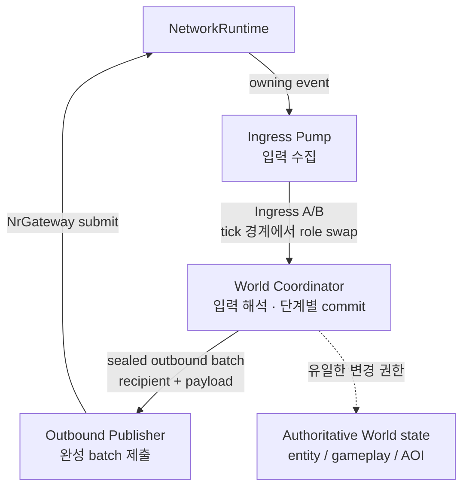
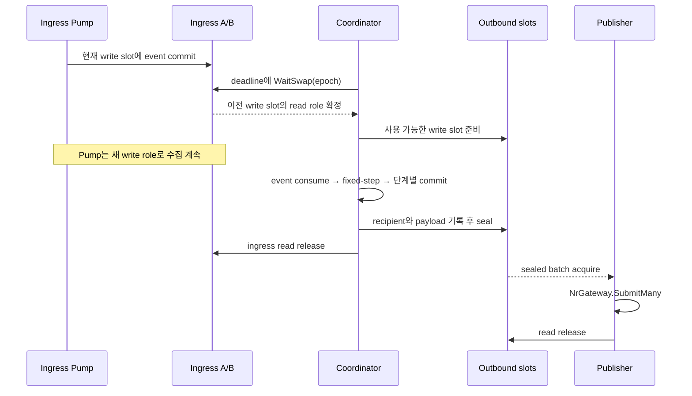

# World Server 실행 ownership과 fixed-step pipeline

> Document status: Reviewed
> Baseline: 0f1fa513762b40bd03a8f5b4203c61d2bb597cd8
> Last reviewed: 2026-09-05

## 핵심 답

World Server의 실행 구조는 객체의 수명과 mutable state 변경 권한을 분리한다. `WorldServerHostRunner`가 NetworkRuntime, World storage, registry, integration adapter와 worker의 수명을 한 process 안에서 조립하고, 실행 중 authoritative state 변경은 Coordinator worker가 직렬화한다.

NetworkRuntime에서 들어온 event와 World에서 생성한 payload는 다음 owner를 거친다.



실선은 **데이터와 buffer ownership 전달**, 점선은 **World state 변경 권한**이다. Pump와 Publisher는 독립 worker로 진행하고, fixed-step 계산과 단계별 commit은 Coordinator가 직렬화한다.

Pump와 Publisher는 World state를 변경하지 않는다. Coordinator는 socket과 IOCP를 소유하지 않는다. 이 분리는 각 단계가 접근할 수 있는 mutable state와 buffer lifetime을 제한한다.

## 책임과 제외 범위

이 문서는 다음 질문을 다룬다.

- World Host가 어떤 객체의 수명을 조립하는가?
- Pump, Coordinator와 Publisher는 어느 slot과 state를 변경할 수 있는가?
- ingress event가 fixed-step simulation과 단계별 commit을 거쳐 outbound batch가 되는 순서는 무엇인가?
- capacity, worker failure와 shutdown에서 ownership이 어떻게 회수되는가?

다음 내용은 별도 문서의 책임이다.

- NetworkRuntime 내부의 IOCP completion, Runtime Session Actor와 socket lifetime
- movement, resource, collision, round, AOI 같은 개별 gameplay 규칙
- Game Client의 prediction과 presentation lifecycle
- capacity와 성능 결과

## Process와 build 경계

`PrivateServer.WorldServer.Host`는 실행 process이며, `PrivateServer.WorldServer`는 Host binary에 link되는 static library다. World Server library를 별도 process나 독립 DLL처럼 해석하지 않는다.

이 문서에서 `World instance`는 Host가 조립한 registry, entity manager, gameplay state, buffer와 worker의 논리적 집합을 뜻한다. 현재 구현에 이 전체를 대표하는 단일 `World` class는 없다.

| 경계 | 현재 책임 |
| --- | --- |
| `PrivateServer.WorldServer.Host` | config 로드, `NrServer`와 `NrGateway` 생성, World 객체와 worker 수명 조립, stop과 lifecycle 마감 |
| `PrivateServer.WorldServer` | World protocol, registry, simulation, double buffer, Coordinator와 worker 계약 |
| `PrivateServer.NetworkRuntime` | listener, Runtime Session, To-World event, outbound framing과 실제 network I/O |

Host application은 World Server static library와 NetworkRuntime public DLL 경계를 함께 소비한다. World protocol/domain/simulation은 NetworkRuntime internal library나 IOCP type에 의존하지 않는다.

관련 project 구성은 [`PrivateServer.WorldServer.vcxproj`](../../src/PrivateServer.WorldServer/PrivateServer.WorldServer.vcxproj)와 [`PrivateServer.WorldServer.Host.vcxproj`](../../src/PrivateServer.WorldServer.Host/PrivateServer.WorldServer.Host.vcxproj)에서 확인할 수 있다.

## Lifetime owner와 mutation owner

[`WorldServerHostRunner::RunWorld`](../../src/PrivateServer.WorldServer.Host/WorldServerHostRunner.cpp)는 다음 객체를 stack 또는 `unique_ptr`로 생성한다. Worker는 이 객체를 소유하지 않고 실행 중에만 reference로 사용한다.

| 대상 | Lifetime owner | Mutable state를 변경하는 실행 권한 |
| --- | --- | --- |
| `WorldIngressDoubleBuffer` | `WorldExecutionStorage` | Pump가 write slot, Coordinator가 acquired read slot |
| `WorldOutboundDoubleBuffer` | `WorldExecutionStorage` | Coordinator가 write slot, Publisher가 acquired read slot |
| `WorldSessionRegistry` | Host의 `RunWorld` scope | Coordinator가 호출하는 event/tick 경로 |
| `WorldEntityManager` | Host의 `RunWorld` scope | Coordinator가 호출하는 commit 경로 |
| `WorldMovementCommandStore` | Host의 `RunWorld` scope | Coordinator의 ingress consume과 tick input 확정 경로 |
| `WorldGameplayState` | `WorldIngressEventConsumer` | Coordinator가 호출하는 gameplay commit 경로 |
| tick, epoch와 deadline | `WorldDoubleBufferedTickCoordinator` | Coordinator worker 하나 |
| `NrGateway` | Host의 `RunWorld` scope가 server-issued value를 보관 | Publisher가 sealed outbound batch를 제출 |

Host scope는 worker보다 오래 유지된다. 정상 종료와 startup rollback은 worker를 먼저 join한 뒤 이 객체들이 파괴되도록 순서를 고정한다.

## Building block과 의존 방향

### World Host

[`WorldServerHostRunner`](../../src/PrivateServer.WorldServer.Host/WorldServerHostRunner.h)는 config를 NetworkRuntime과 World 실행 설정으로 나누어 전달한다. Host 하나는 config의 Channel ID/name과 하나의 `NrServer`, 하나의 World execution graph를 사용한다.

Host는 다음 순서로 실행 graph를 만든다.

1. `NrServer`를 생성하고 listener를 시작한다.
2. server-bound `NrGateway`를 발급받는다.
3. [`WorldExecutionStorage`](../../src/PrivateServer.WorldServer/WorldExecutionStorage.h)에서 ingress A/B storage와 outbound slot storage를 생성한다.
4. registry, event source, event consumer, Pump, Coordinator와 Publisher를 생성한다.
5. Publisher, Pump, Coordinator 순서로 worker를 시작한다.

Worker startup이 중간에 실패하면 [`WorldWorkerStartup`](../../src/PrivateServer.WorldServer/WorldWorkerStartup.h)이 이미 시작된 worker를 역순으로 stop/join한다.

실행 중에는 세 worker thread가 pipeline을 진행하고 Host main thread는 stop 조건과 runtime sample을 관찰한다. Host main thread가 authoritative state를 직접 갱신하지는 않는다.

### Ingress Pump

[`WorldIngressPump`](../../src/PrivateServer.WorldServer/WorldIngressPump.h)는 NetworkRuntime To-World queue의 단일 consumer다. 정상 실행에서는 `RunStep`을 반복해 owning `NrToWorldEvent`를 현재 ingress write slot으로 이동한다. Coordinator가 fixed-step deadline에 role swap을 요청하면 이전 write slot이 해당 epoch의 read batch가 된다.

Pump는 payload를 decode하지 않고 session/entity registry에도 접근하지 않는다. Slot이 가득 차면 남은 event를 To-World queue에 두고 writable capacity를 기다린다. 입력량 때문에 tick 경계를 앞당기지 않는다.

### Coordinator

[`WorldDoubleBufferedTickCoordinator`](../../src/PrivateServer.WorldServer/WorldDoubleBufferedTickCoordinator.h)는 authoritative epoch, server tick, absolute deadline과 bounded catch-up을 소유한다. 같은 epoch의 ingress slot을 acquire한 뒤 다음 순서로 실행한다.

1. [`WorldIngressEventConsumer`](../../src/PrivateServer.WorldServer/WorldIngressEventConsumer.h)가 event 순서대로 session lifecycle과 packet을 해석한다.
2. 최종 session set과 command state에서 immutable tick input/read view를 만든다.
3. [`WorldTickProcessor`](../../src/PrivateServer.WorldServer/WorldTickProcessor.h)가 movement와 physics phase를 계산하고 canonical entity state에 commit한다.
4. [`WorldGameplayPhase`](../../src/PrivateServer.WorldServer/WorldGameplayPhase.h)가 read view에서 typed result를 계산한다.
5. [`WorldGameplayCommitter`](../../src/PrivateServer.WorldServer/WorldGameplayCommitter.h)가 resource, score, round와 entity lifecycle 결과를 canonical state에 반영한다.
6. event consumer가 durable lifecycle/gameplay record와 cadence가 도래한 snapshot을 outbound write slot에 기록한다.
7. outbound batch를 seal한 뒤 ingress read slot을 release한다.

따라서 tick 전체를 한 번에 반영하는 단일 `canonical commit` 함수가 있는 구조는 아니다. Coordinator thread가 ingress lifecycle/command 반영, movement 결과 반영, gameplay와 spawn 결과 반영처럼 단계별 commit 경계를 순서대로 직렬화한다.

Catch-up이 필요하면 한 batch에서 config의 `maxCatchUpSteps`까지만 연속 tick을 처리한다. Fixed delta는 변하지 않으며 다음 plan의 deadline은 이전 absolute deadline에 실제 처리한 fixed step 수를 더해 계산한다. Catch-up batch에서도 ingress event는 한 번만 소비하고, 각 simulation tick의 durable 결과를 기록한 뒤 최종 snapshot을 한 번 계획한다.

### Outbound Publisher

[`WorldOutboundPublisher`](../../src/PrivateServer.WorldServer/WorldOutboundPublisher.h)는 sealed outbound read slot의 record 순서를 유지하며 `NrGateway::SubmitMany`를 호출한다. Publisher는 recipient를 다시 선택하거나 payload 의미를 해석하지 않고, World state와 session registry에도 접근하지 않는다.

`NrGateway`의 accepted 결과는 Runtime 쪽 payload/mailbox admission을 뜻하며 socket send completion을 뜻하지 않는다. Transport framing과 per-session socket send는 NetworkRuntime 책임이다.

## Worker 협업과 buffer ownership

정상 실행에서는 buffer의 role과 slot state가 data ownership을 전달한다.

- [`WorldIngressDoubleBuffer`](../../src/PrivateServer.WorldServer/WorldIngressDoubleBuffer.h): Pump가 write claim을 얻어 event를 commit하고, Coordinator의 `WaitSwap`이 active claim과 read release 조건을 확인한 뒤 read/write role을 바꾼다.
- [`WorldOutboundDoubleBuffer`](../../src/PrivateServer.WorldServer/WorldOutboundDoubleBuffer.h): Coordinator가 비어 있는 write slot을 준비하고 `Writing -> Sealed -> Reading -> Empty` 전이로 Publisher에게 넘긴다.
- [`WorldIngressWorkerExchange`](../../src/PrivateServer.WorldServer/WorldDoubleBufferedWorkers.h): terminal drain에서만 Coordinator가 plan을 게시하고 Pump가 같은 epoch의 completion을 반환한다.

Pump는 input과 writable capacity를, Publisher는 sealed batch를 기다리며 독립적으로 진행한다. 정상 tick마다 별도의 worker plan/completion 왕복을 만들지 않는다. Buffer wait timeout이나 close는 해당 operation의 결과로 처리한다.

Ingress는 A/B 역할로 나뉜 slot을 사용한다. Outbound는 [`WorldOutboundBufferSlotCount`](../../src/PrivateServer.WorldServer/WorldOutboundDoubleBuffer.h)의 `Double`과 `Triple`을 지원하며, 현재 [`WorldServerHostRunner`](../../src/PrivateServer.WorldServer.Host/WorldServerHostRunner.cpp)는 `Triple`로 조립한다. Slot 수와 capacity는 startup에 고정된다.

현재 Host의 outbound는 다음 작업을 서로 다른 slot에 보관할 수 있다. 아래 N은 batch 순서를 뜻하며 slot의 고정 identity가 아니다.

```text
Publisher가 소비 중       : Reading N
ready queue에서 소비 대기 : Sealed N+1
Coordinator가 작성 중     : Writing N+2
```

Sealed batch는 ready queue 순서대로 Publisher에 전달된다. 모든 slot이 점유되면 Coordinator는 빈 write slot을 기다린다. Ingress slot은 owning event 배열을, outbound slot은 record·recipient channel·payload byte 영역을 각각 보유한다. Hot path에서 slot을 동적으로 확장하거나 다른 mode로 fallback하지 않는다.

## 정상 tick 순서

[`WorldDoubleBufferedCoordinatorWorker`](../../src/PrivateServer.WorldServer/WorldDoubleBufferedCoordinatorWorker.cpp)의 한 cycle은 다음 순서를 사용한다.



화살표는 **호출과 batch 전달 순서**다. Pump의 다음 입력 수집과 Publisher의 이전 batch 제출은 Coordinator 계산과 겹칠 수 있다. Coordinator는 새 write slot을 확보할 수 없으면 기다리며, 아직 사용 중인 slot을 덮어쓰지 않는다. 모든 canonical World mutation은 Coordinator 안에서 순서를 유지한다.

## Interface와 invariant

- Epoch는 0이 아닌 buffer handoff generation이며 ingress read batch와 outbound batch를 연결한다. 한 epoch에서 catch-up tick을 여러 개 처리할 수 있으므로 server tick과 1:1 값이 아니다.
- Ingress는 Pump 한 명만 write하고 Coordinator 한 명만 read한다.
- Outbound는 Coordinator 한 명만 write하고 Publisher 한 명만 read한다.
- Coordinator만 authoritative tick/epoch를 전진시키고 registry와 gameplay commit을 호출한다.
- `NrToWorldEvent`가 소유한 payload view는 event consume 중에 decode하며 World domain command에 Runtime view를 보관하지 않는다.
- 계산이 필요한 movement/gameplay phase는 immutable input/read view에서 typed result를 만든다. Ingress lifecycle/command 처리와 각 result 반영은 Coordinator thread의 단계별 commit 경계에서 수행한다.
- Ingress role swap은 active claim과 이전 read의 release 조건을 지킨다. Outbound는 `Empty` slot만 새 write로 준비하며 느린 reader를 덮어쓰지 않는다.
- Ingress는 빈 batch도 tick boundary에 넘길 수 있지만 outbound record가 비어 있으면 publication batch를 만들지 않는다.
- Outbound record의 recipient와 payload range는 slot이 `Reading`인 동안만 유효하며 Publisher가 release한 뒤 reset된다.
- Outbound publication은 canonical state commit과 하나의 transaction이 아니다. Commit 뒤 outbound write 또는 publication이 실패하면 World state를 rollback하지 않고 controlled stop으로 전환한다.

## Failure와 pressure

| 상황 | 현재 동작 |
| --- | --- |
| ingress slot capacity 도달 | writable capacity를 기다리고 남은 event는 To-World queue에 보존 |
| ingress source 또는 role exchange 실패 | worker failure로 종료하고 Host stop 경로로 전환 |
| 다음에 사용할 buffer slot이 아직 사용 중 | ownership 반환을 기다리며, wait가 실패하면 정상 tick을 계속하지 않음 |
| outbound append capacity 초과 | 실패한 append는 usage를 부분 변경하지 않으며 batch를 publish하지 않고 controlled stop |
| `SubmitMany` call 실패 | 현재 batch를 release하고 미처리 record를 discarded로 집계한 뒤 Publisher failure로 종료 |
| recipient 일부 reject | accepted/rejected를 집계하고 다음 record를 계속 처리하며 accepted recipient를 rollback하지 않음 |
| worker의 예기치 않은 종료 | Host가 worker stop reason과 마지막 tick/buffer 상태를 기록하고 전체 stop을 요청 |

Bounded capacity는 [`WorldServerHostConfig`](../../src/PrivateServer.WorldServer.Host/WorldServerHostConfig.h)의 execution/network 설정으로 정한다. Capacity 부족을 동적 확장으로 숨기지 않고 명시적인 stop reason과 controlled stop으로 전환한다.

## Shutdown과 lifetime 회수

[`WorldWorkerShutdown`](../../src/PrivateServer.WorldServer/WorldWorkerShutdown.h)은 새 output을 만들 수 없는 시점과 Runtime admission이 닫히는 시점을 다음 순서로 고정한다.

1. Coordinator가 새 gameplay tick과 outbound 생성을 중단한다.
2. Publisher가 마지막 sealed outbound batch를 drain하고 join한다.
3. Coordinator를 terminal consume mode로, Pump를 terminal drain mode로 전환한다.
4. `NrServer::RequestStop`과 `Shutdown`을 호출한다.
5. Runtime shutdown과 동시에 Pump/Coordinator가 남은 To-World event를 같은 ingress A/B slot로 반복 drain한다.
6. Pump와 Coordinator를 join한다.
7. Host가 terminal state를 마감한 뒤 World/Runtime owner를 파괴한다.

Terminal consume에서는 `SessionAccepted`와 `SessionClosed`만 lifecycle 정리를 위해 처리한다. `PacketReceived`는 decode하거나 simulation에 적용하지 않고 폐기한다. Terminal epoch는 server tick을 증가시키지 않는다.

Gameplay stop, outbound drain, terminal ingress drain 또는 Runtime shutdown 중 하나가 실패해도 가능한 join과 cleanup은 계속 수행하고 최종 report가 실패 단계를 구분한다.

## 관련 구현과 테스트

| 독자 질문 | 관련 구현 | 관련 테스트 |
| --- | --- | --- |
| Host는 Runtime과 World worker lifetime을 어디서 조립하는가? | `WorldServerHostRunner`, `WorldWorkerStartup` | `WorldWorkerStartupTests` |
| ingress A/B slot owner는 epoch마다 어떻게 바뀌는가? | `WorldIngressPump`, `WorldIngressDoubleBuffer`, `WorldDoubleBufferRoleExchange`, `WorldDoubleBufferedCoordinatorWorker` | `WorldIngressPumpTests`, `WorldDoubleBufferRoleExchangeTests`, `WorldDoubleBufferedWorkersTests` |
| absolute deadline과 bounded catch-up은 어떻게 server tick을 전진시키는가? | `WorldDoubleBufferedTickCoordinator` | `ConsumesOneEpochAndAdvancesAbsoluteDeadline`, `ProcessesAtMostConfiguredCatchUpSteps` |
| movement와 gameplay 결과는 어디서 canonical state에 반영되는가? | `WorldTickProcessor`, `WorldGameplayCommitter` | `WorldTickProcessorTests`, `WorldGameplayCommitterTests` |
| outbound batch의 순서와 실패 의미는 어디서 정의되는가? | `WorldOutboundDoubleBuffer`, `WorldOutboundPublisher` | `WorldOutboundDoubleBufferTests`, `WorldOutboundPublisherTests` |
| shutdown owner와 join 순서는 어디서 고정되는가? | `WorldWorkerShutdown` | `DrainsOutboundBeforeTerminalIngressAndRuntimeShutdown` |
| public Runtime boundary까지 연결되는 통합 경로는 무엇인가? | `WorldServerHostRunner`와 NetworkRuntime public API | `WorldPublicLoopbackTests` |

주요 테스트 위치:

- [`WorldIngressPumpTests.cpp`](../../src/PrivateServer.WorldServer.Tests/WorldIngressPumpTests.cpp)
- [`WorldDoubleBufferRoleExchangeTests.cpp`](../../src/PrivateServer.WorldServer.Tests/WorldDoubleBufferRoleExchangeTests.cpp)
- [`WorldDoubleBufferedTickCoordinatorTests.cpp`](../../src/PrivateServer.WorldServer.Tests/WorldDoubleBufferedTickCoordinatorTests.cpp)
- [`WorldDoubleBufferedWorkersTests.cpp`](../../src/PrivateServer.WorldServer.Tests/WorldDoubleBufferedWorkersTests.cpp)
- [`WorldOutboundDoubleBufferTests.cpp`](../../src/PrivateServer.WorldServer.Tests/WorldOutboundDoubleBufferTests.cpp)
- [`WorldOutboundPublisherTests.cpp`](../../src/PrivateServer.WorldServer.Tests/WorldOutboundPublisherTests.cpp)
- [`WorldWorkerShutdownTests.cpp`](../../src/PrivateServer.WorldServer.Tests/WorldWorkerShutdownTests.cpp)
- [`WorldPublicLoopbackTests.cpp`](../../src/PrivateServer.WorldServer.Tests/WorldPublicLoopbackTests.cpp)

## 관련 결정

- [ADR 0004. C++/IOCP Project Baseline](../../docs/adr/0004-cpp-iocp-project-baseline.md)
- [ADR 0006. NetworkRuntime World Integration Contract](../../docs/adr/0006-network-runtime-world-integration-contract.md)
- [World Server와 NetworkRuntime 경계 규칙](../../docs/design/conventions/world-server-runtime-boundary.md)
- [Authoritative gameplay과 round contract](authoritative-gameplay-and-round-contract.md)
- [Gameplay protocol reference](gameplay-protocol-reference.md)

## 지원 범위와 제약

- 현재 serving profile은 inbound/outbound 모두 `DoubleBuffered` execution mode를 사용한다. 이 mode 이름은 worker와 buffer 실행 경로를 구분하며 outbound slot 수를 뜻하지 않는다. Host의 outbound slot 구성은 `Triple`이다.
- Host process 하나는 Channel 하나와 독립된 논리적 World instance 하나를 소유한다. 여러 Channel의 World state를 한 Coordinator가 공유하지 않는다.
- 현재 pipeline은 하나의 Coordinator가 authoritative mutation을 직렬화한다. Region partition, World actor와 병렬 job commit은 제공 범위가 아니다.
- Buffer storage와 exchange는 bounded다. Capacity 설정은 workload에 맞게 정해야 하며 자동 확장하지 않는다.
- Outbound Gateway admission과 실제 socket completion은 서로 다른 완료 시점이다.
- 이 문서는 단일 Channel의 최대 수용 인원이나 tick latency 목표를 보장하지 않는다.
